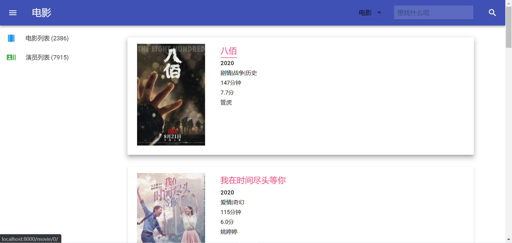
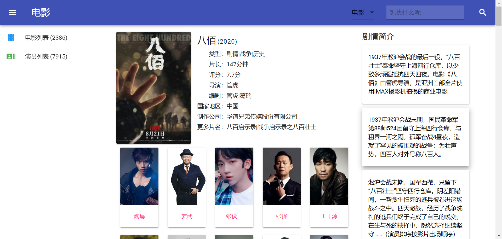
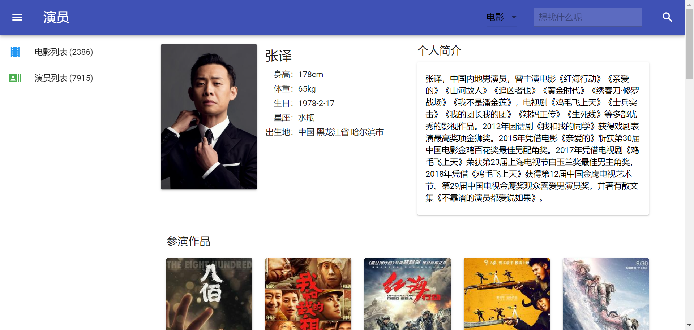
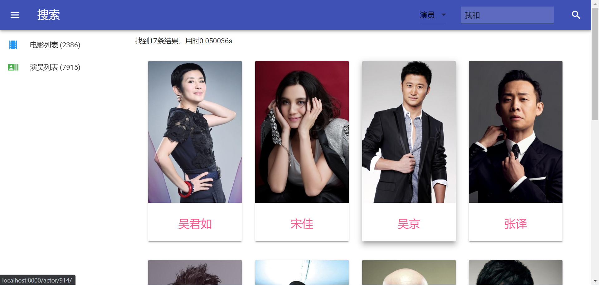
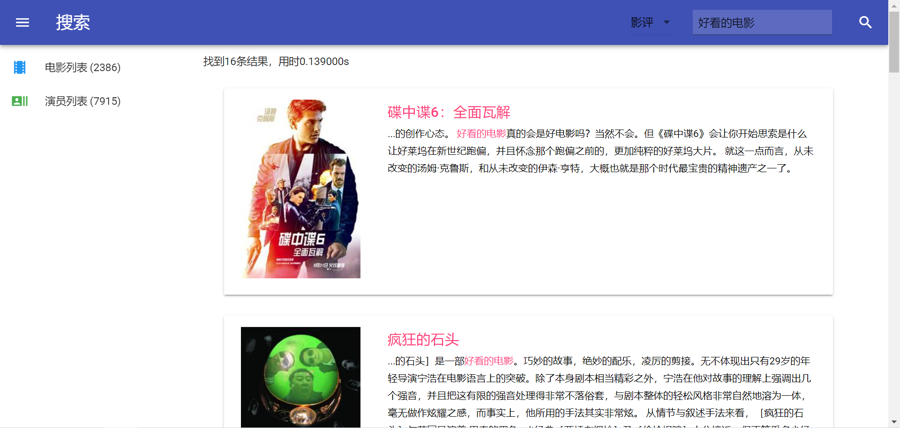
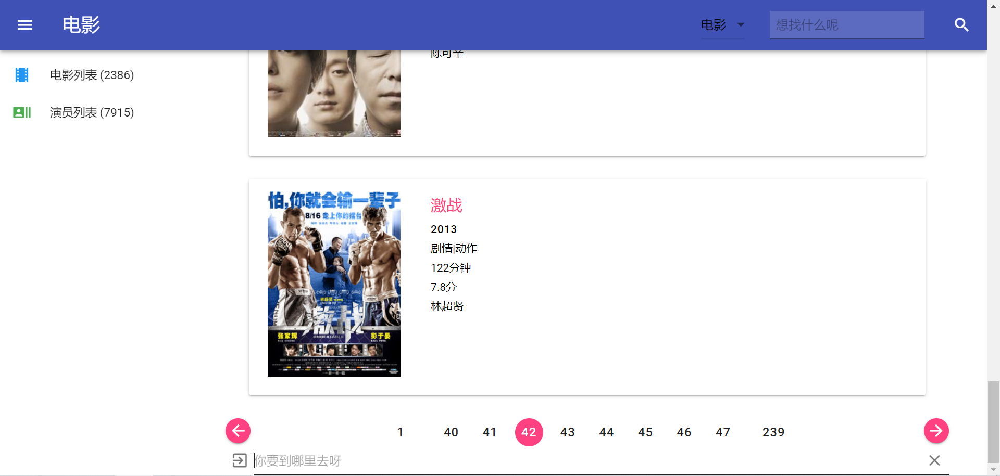

# 设计文档

> Proudly powered by MDUI, following the guidelines of Material Design.

## 成果展示

## 统计信息

共爬取了中国地区的`2386`部电影、`7915`名相关演员及`12678`条影评。

搜索时长可基本维持在`0.1s`以内。

## 技术细节

### 爬虫

爬取了时光网前`2400`条中国地区电影，并进一步爬取了相关演员。

使用`urllib`+`HTMLParser`进行网页爬取。

爬取的信息经整合后保存为三个`.json`文件：

- `movie_merged.json`：保存所有电影相关的信息；
- `actor_merged.json`：保存所有演员相关的信息；
- `collaboration_graph.json`：保存演员的合作信息。

### 后端

使用`Django`完成后端。

#### 模型

建立了四个模型：`Actor`、`Movie`、`Plot`、`Review`。

在`Movie`中添加了一个指向`Actor`的多对多字段`actors`，以实现电影和演员间的多对多关系。

在`Plot`和`Review`中均添加了指向`Movie`的外键，以实现剧情、影评和电影间的多对一关系。

#### 分页

使用`Django`内置的`Paginator`实现分页。

#### 通用视图

使用`Django`内置的通用视图，以减少大量重复的样板代码。

电影和演员列表使用了`generic.ListView`，电影和演员详情使用了`generic.DetailView`。

### 前端

遵循`Material Design`设计规范。

#### 前端框架

使用`MDUI`作为前端框架，以便捷地实现`Material`风格。

#### 其它库

使用了`jQuery`，用于使搜索、关键字高亮等功能得以正确表现。

## 心得体会

- 真正意义上体验了一次从零开始建网站，看到成果还是挺有成就感的。
- 用好前端框架很重要，`MDUI`好看。
- 当数据规模更大时，当前较为朴素的搜索策略将不再满足需求，需要采用建立索引等手段来提高搜索速度。